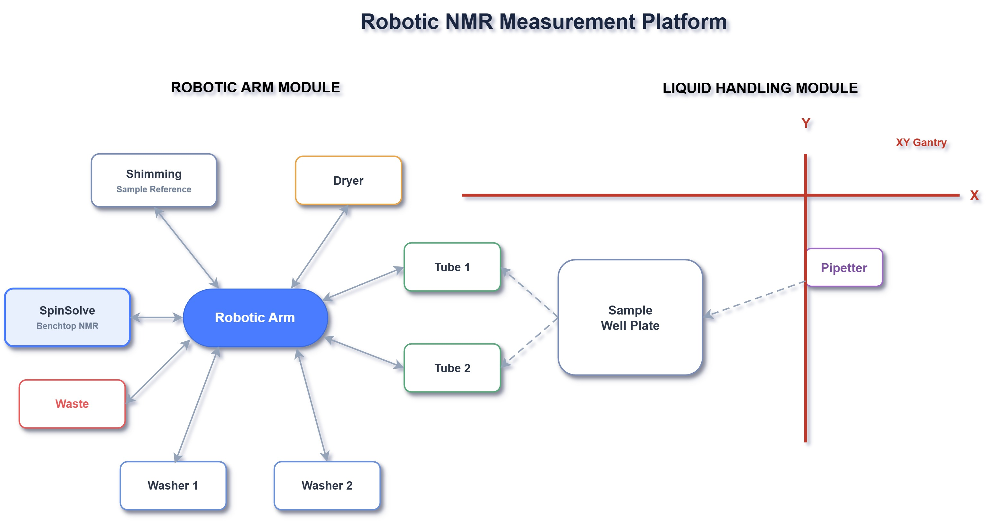

# bruce-nmr-station

An automated NMR laboratory station for high-throughput chemical screening. The system integrates a robotic arm, an automated liquid handler, and a benchtop NMR spectrometer to autonomously prepare samples, acquire spectra, and calculate chemical yields — with minimal human intervention.



## Publication

This repository contains the automation and data-treatment code supporting:

> Yankai Jia, Wai-Shing Wong, Yasemin Bilgi-Gadina, Louis P. J.-L. Gadina, King-Lam Kwong, Yanqiu Jiang, Nikolaos Vagkidis, Benito Marazzi, Peter R. Schreiner, and Bartosz A. Grzybowski.
> **"From Berzelius to hyperspace: Unexpected reactivity in textbook brominations."**

---

## Overview

The platform operates in two stages:

1. **Automation** (`nmr-station/`) — A Flask web app + scheduler orchestrates three hardware devices:
   - Robot arm picks up and transports sample tubes
   - Pipetter aspirates reaction samples into measurement tubes
   - NMR spectrometer acquires 1H spectra on demand
   - NMR tubes are automatically cleaned and dried after each measurement

2. **Data Treatment** (`data-treatment/`) — A post-processing pipeline calculates chemical yields:
   - Integrates NMR peaks with baseline correction
   - Interpolates concentrations from 2D calibration curves
   - Exports yield, conversion, and selectivity metrics to CSV

3. **Raw Data** (`data/`) — NMR run folders stored outside version control (git-ignored):
   - One subfolder per reaction campaign (e.g. `DPE_bromination/`)
   - Each run folder contains raw spectra, plate-map Excel files, and pipeline outputs


## System Architecture

```
┌─────────────────────────────────────────────────────────────┐
│                      nmr-station/                           │
│                                                             │
│   app.py (Flask UI)  ──►  scheduler.py (Orchestrator)       │
│                               │                             │
│              ┌────────────────┼────────────────┐            │
│              ▼                ▼                ▼            │
│       robotic_arm/      spectrometer/      pipetter/        │
│       Meca500           Spinsolve 80       miniPi           │
│       (TCP/IP)          (TCP/IP XML)       (Serial)         │
└─────────────────────────────────────────────────────────────┘
                              │
                          NMR spectra
                              │
                              ▼
┌─────────────────────────────────────────────────────────────┐
│                    data-treatment/                          │
│                                                             │
│   main.py  ──►  Integrator  ──►  conc_interpolation        │
│                                       │                     │
│                               Yield / Selectivity CSV       │
└─────────────────────────────────────────────────────────────┘
                              │
                          outputs
                              │
                              ▼
┌─────────────────────────────────────────────────────────────┐
│                       data/  (git-ignored)                  │
│                                                             │
│   DPE_bromination/                                          │
│   └── YYYY-MM-DD-runXX_<solvent>_<additive>/                │
│       ├── Results/  (fitting_results.json, interp_conc.json)│
│       ├── <spectra folders>/                                │
│       └── out_concentrations.csv                            │
└─────────────────────────────────────────────────────────────┘
```


## Hardware Requirements

| Device | Model | Connection |
|--------|-------|------------|
| Robot arm | Mecademic Meca500 | TCP/IP — `192.168.0.100` |
| NMR spectrometer | Spinsolve 80 MHz | TCP/IP — `127.0.0.1:13000` (XML protocol) |
| Liquid handler | miniPi (GRBL-based) | Serial (USB) |


## Software Requirements

- **Python**: 3.10
- **Environment manager**: Conda (environment named `brucelee`)

Key packages:

| Package | Purpose |
|---------|---------|
| `mecademicpy` | Mecademic robot arm control |
| `nmrglue` | NMR spectrum reading and processing |
| `Flask` | Web UI for automation control |
| `PySimpleGUI` | Desktop dialogs for data treatment |
| `pyserial` | Serial communication with pipetter |


## Installation

### 1. Clone the repository

```bash
git clone <repo-url>
cd bruce-nmr-station
```

### 2. Create the conda environment

```bash
conda env create -f environment.yml
conda activate brucelee
```

### 3. Configure environment variables

Fill in the settings file at `nmr-station/settings/.env`:

```env
ROBOT_ARM_HOST=192.168.0.100
ROBOT_ARM_LOG_PATH=<path-to-log-folder>
SPECTROMETER_REMOTE_CONTROL_HOST=127.0.0.1
SPECTROMETER_REMOTE_CONTROL_PORT=13000
ROBOCHEM_DATA_PATH=<path-to-data-root>
PIPETTER_LOG_PATH=<path-to-pipetter-log>
MEASUREMENT_DATA_GUI_PATH=<path-to-gui-state-json>
```

### 4. Configure robot arm coordinates

Edit `nmr-station/robotic_arm/facility_config.json` to match the physical positions of:
- Tube racks (tube1–tube4)
- Washer stations (washer1, washer2)
- Dryer
- Spectrometer insertion point (spinsolve)
- Waste collector and flip stands
- Reference sample slot

---

## Usage

### Run the automation (web UI mode)

```bash
python nmr-station/app.py
```

Open `http://localhost:5000` in a browser. Select a protocol (1D PROTON, 1D EXTENDED+, 1D WET SUP), configure parameters, set the sample order, and click **Start Automation**.

### Run the automation (direct scheduler mode)

```bash
python nmr-station/scheduler.py
```

A GUI checklist will guide you through pre-flight checks (WiFi, vacuum, solvent levels, etc.), then automatically begin the measurement sequence.

### Run data treatment (yield calculation)

```bash
python data-treatment/main.py
```

A dialog will prompt for:
- Reaction name, user name, well plate number
- Reaction solvent
- Excel file with reaction conditions and container UUIDs
- Vials to process (e.g. `0-5, 7, 10-12`)

Results are exported as a CSV with yield, conversion, and selectivity for each sample.

### Testing without hardware

Substitute real device modules with dummies in `nmr-station/tests/`:

```python
from tests.dummy_robotarm import RobotArm
from tests.dummy_pipetter import Pipetter
from tests.dummy_spectrometer import Spectrometer
```

---

## Project Structure

```
bruce-nmr-station/
│
├── nmr-station/                    # Automation & hardware control
│   ├── app.py                      # Flask web application
│   ├── scheduler.py                # Core orchestration engine
│   ├── scheduler_Benito.py         # User-specific scheduler variants
│   ├── robotic_arm/                # Mecademic Meca500 control
│   │   ├── roboarm.py              # Main robot arm interface
│   │   ├── meca.py                 # Low-level Mecademic wrapper
│   │   ├── facility.py             # Lab layout and position management
│   │   └── facility_config.json    # Physical coordinate configuration
│   ├── spectrometer/               # Spinsolve NMR control
│   │   ├── spectrometer.py         # Remote control interface
│   │   └── xml_converter.py        # XML protocol builder
│   ├── pipetter/                   # miniPi liquid handler control
│   │   ├── pipetter.py             # Main pipetter interface
│   │   ├── breadboard.py           # Hardware-level control
│   │   └── grbl/                   # Motion controller firmware files
│   ├── shared_state/               # Thread-safe inter-device communication
│   ├── settings/                   # .env and config loader
│   ├── templates/                  # Jinja2 HTML templates (web UI)
│   ├── tests/                      # Dummy device implementations
│   └── deprecated/                 # Legacy code (kept for reference)
│
├── data-treatment/                 # NMR data analysis pipeline
│   ├── main.py                     # Pipeline entry point
│   ├── config.py                   # Paths, outlier lists, chemistry config
│   ├── Integrator_v3_baseline.py   # Python peak integration with baseline correction
│   ├── peak_assignment_for_BDA.py  # Species-specific peak assignment
│   ├── conc_interpolation.py       # 1D concentration interpolation
│   ├── conc_interpolation_2D.py    # 2D RBF calibration curve interpolation
│   ├── utils.py                    # Shared utilities
│   ├── MNova_script/               # QtScript for MNova peak fitting (alternative to Integrator)
│   ├── TBABr_pipeline.ipynb        # Example notebook for TBABr runs end-to-end
│   └── old_scripts/                # Legacy analysis scripts
│
├── data/                           # Raw NMR data (git-ignored, stored locally)
│   └── DPE_bromination/            # DPE bromination reaction campaign
│       ├── YYYY-MM-DD-runXX_*/     # One folder per automated run
│       │   ├── Results/            # Pipeline outputs (fitting_results.json, interp_conc.json, …)
│       │   ├── <spectrum folders>/ # Raw 1H NMR spectra (data.csv per spectrum)
│       │   ├── out_concentrations.csv  # Reagent concentrations from plate map
│       │   └── *.xlsx              # Plate map with vial UUIDs and conditions
│       ├── NMR_calibration_*/      # Calibration reference runs (no additive)
│       └── README.md               # Campaign-level documentation
│
├── environment.yml                 # Conda environment specification
└── README.md
```

---

## Data Treatment Pipeline

```
NMR spectra (Bruker format)
        │
        ▼
Integrator_v3_baseline.py
  - Baseline correction
  - Peak detection and integration
        │
        ▼
conc_interpolation_2D.py
  - 2D spline calibration curve
  - Area → concentration conversion
        │
        ▼
optional:peak_assignment_for_BDA.py
  - Rule-based peak assignment per species
  - Stoichiometric area constraints
  - Collision resolution for overlapping peaks
        │
        ▼
Yield / Selectivity / Conversion
  - CSV export with per-sample metrics
  - Outlier filtering by UUID
```

## Configuration Reference

| File | Purpose |
|------|---------|
| `nmr-station/settings/.env` | Hardware connection settings and file paths |
| `nmr-station/robotic_arm/facility_config.json` | Physical robot arm coordinates |
| `data-treatment/config.py` | Data path, outlier UUIDs, NMR peak parameters, compound mappings |
| `environment.yml` | Full pinned conda environment |
